# Data Flywheel — Diagrams (Mermaid)

**Hướng dẫn:** Copy code Mermaid vào editor hỗ trợ (GitHub, Notion, Obsidian) hoặc [mermaid.live](https://mermaid.live)

---

## 1. Vòng lặp Data Flywheel cơ bản

---

## 2. Vòng lặp 4 bước (Ingest → Digest → Output → Repeat)

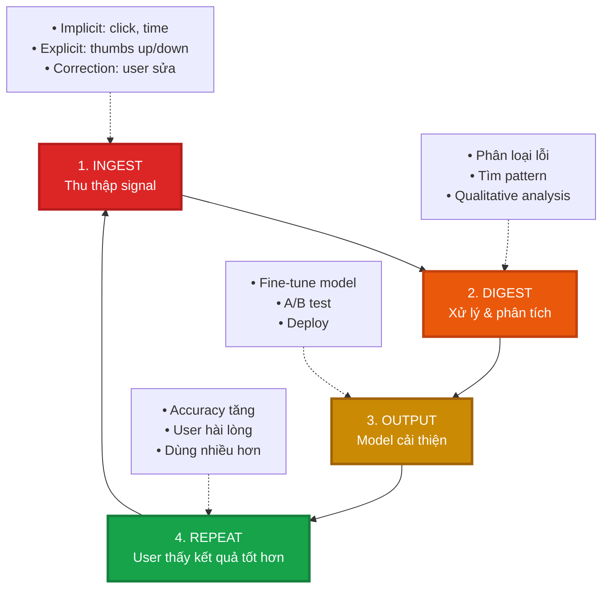

---

## 3. V-App V-AI — As-is (Vòng lặp đứng)

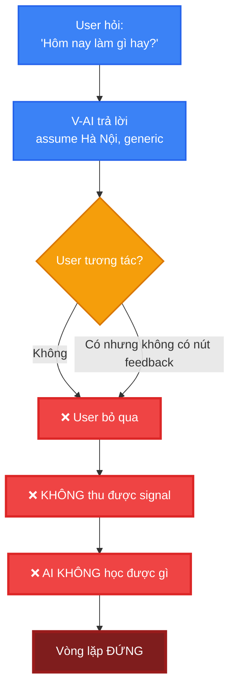

---

## 4. V-App V-AI — To-be (Vòng lặp hoạt động)

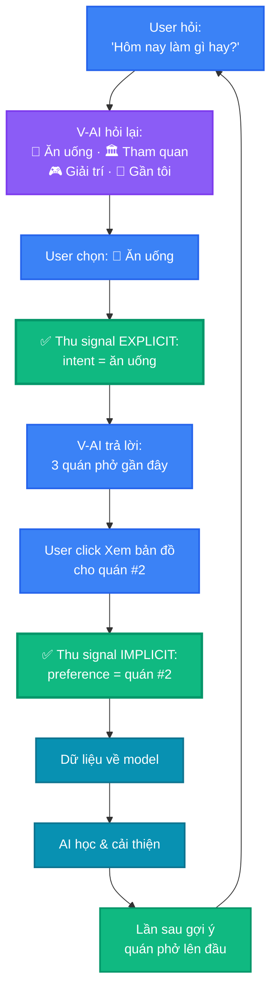

---

## 5. Agency Progression: V1 → V2 → V3

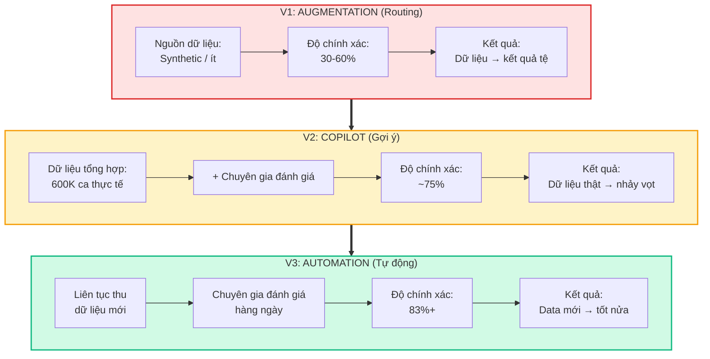

---

## 6. Microsoft Dragon — Data Flywheel thực tế

```mermaid
graph LR
    subgraph Phase1[" Phiên bản V1 "]
        A[Nguồn dữ liệu:<br/>Synthetic]
        B[Độ chính xác:<br/>30-60%]
        C[Kết quả:<br/>Dữ liệu → kết quả tệ]
    end
    
    subgraph Phase2[" Phiên bản V2 "]
        D[Dữ liệu tổng hợp:<br/>600K ca + chuyên gia]
        E[Độ chính xác:<br/>~75%]
        F[Kết quả:<br/>Dữ liệu thật → nhảy vọt]
    end
    
    subgraph Phase3[" Phiên bản V3 "]
        G[Liên tục thu dữ liệu]
        H[Bác sĩ đánh giá hàng ngày]
        I[Độ chính xác:<br/>83%+]
    end
    
    Phase1 --> Phase2
    Phase2 --> Phase3
    Phase3 -.Loop liên tục.-> Phase3
    
    style Phase1 fill:#fecaca,stroke:#dc2626,stroke-width:3px
    style Phase2 fill:#fed7aa,stroke:#ea580c,stroke-width:3px
    style Phase3 fill:#86efac,stroke:#16a34a,stroke-width:3px
```

---

## 7. 3 loại Feedback Signal

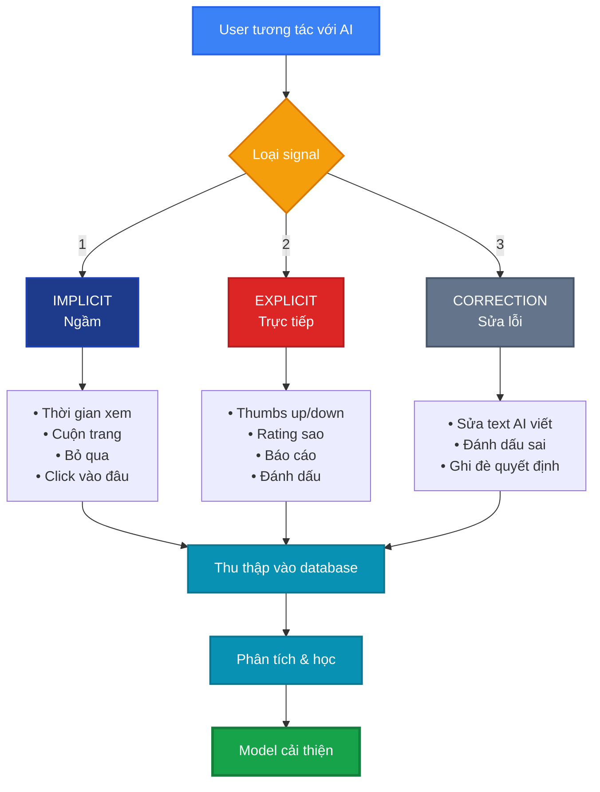

---

## 8. Sai lầm phá vỡ Flywheel

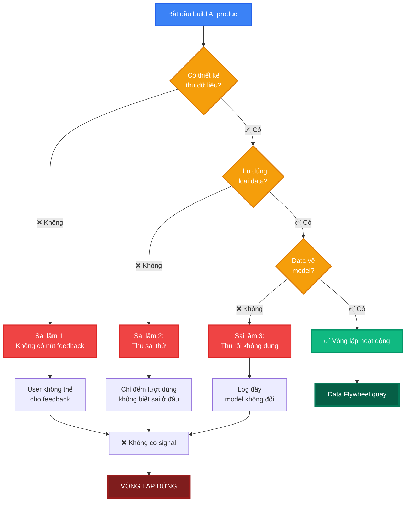

---

## 9. Timeline: Tốc độ vòng lặp (Metabolism)

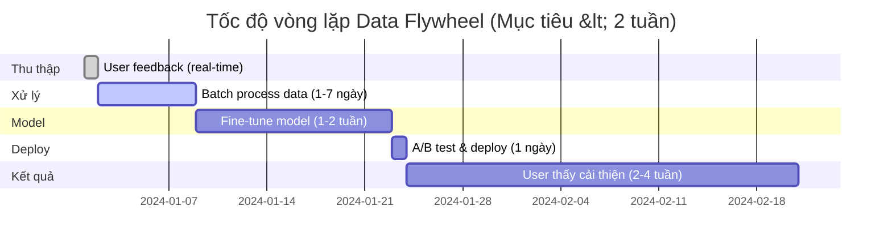

---

## 10. So sánh: Synthetic vs Real Data

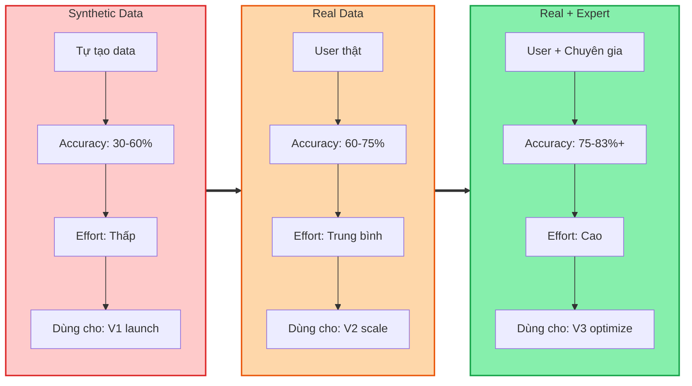

---

## 11. Data Flywheel vs Alexa Effect (Vòng xoáy đi xuống)

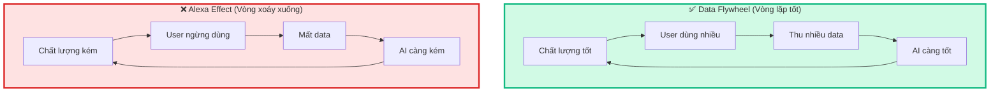

---

## 12. Checklist: Vòng lặp tốt

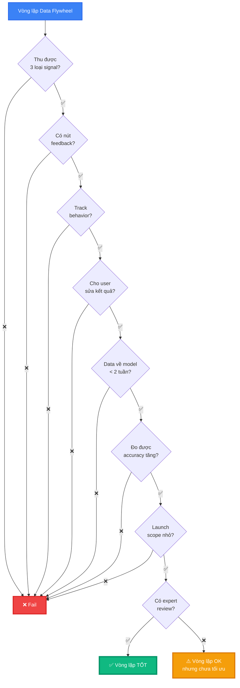

---

## Hướng dẫn sử dụng

1. **Copy code Mermaid** từ các section trên
2. **Paste vào:**
   - GitHub README.md (tự render)
   - [mermaid.live](https://mermaid.live) (preview & export PNG/SVG)
   - Notion (dùng `/code` → chọn Mermaid)
   - Obsidian (cài plugin Mermaid)
   - VS Code (cài extension Markdown Preview Mermaid)

3. **Customize:**
   - Đổi text trong `[]` để phù hợp sản phẩm của bạn
   - Đổi màu: `fill:#HEX_COLOR`
   - Thêm/bớt node theo nhu cầu

---

*Tài liệu tham khảo:*
- data-flywheel-guide.md
- 01-ux-exercise.md (V-App case study)
- 04-reference-document.md (Microsoft Dragon)

