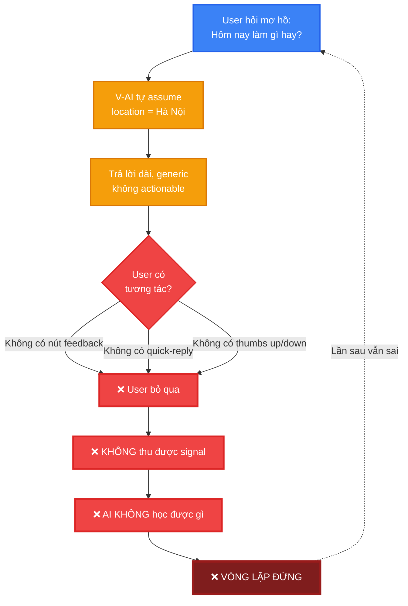
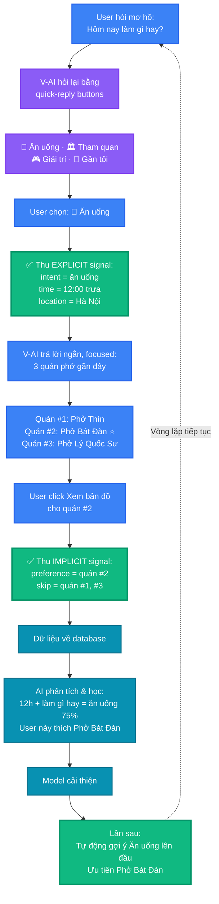
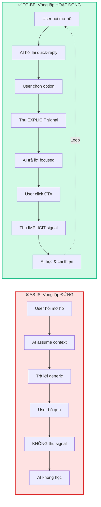
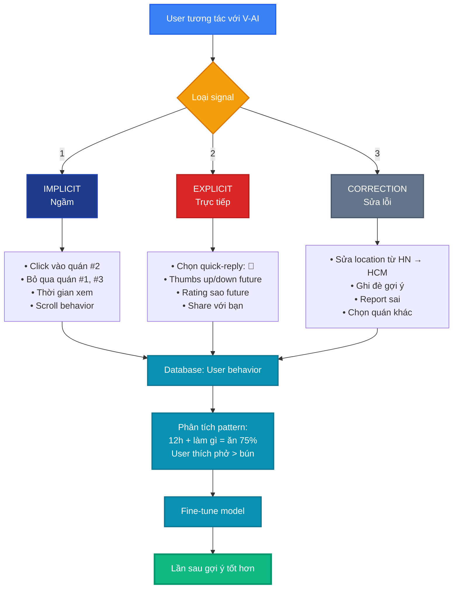
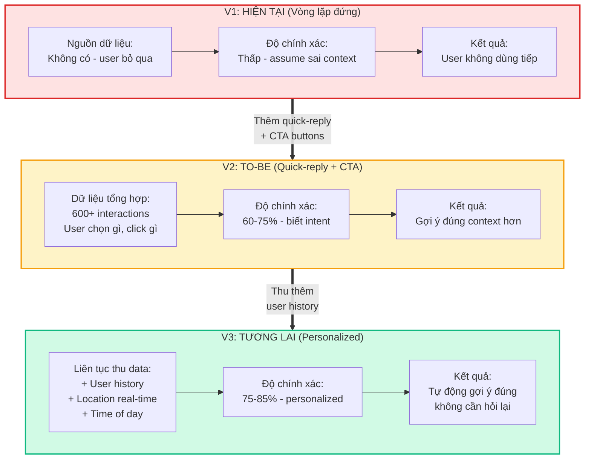
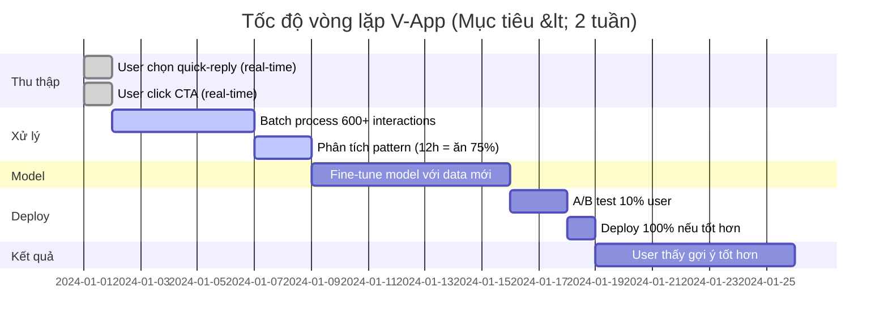
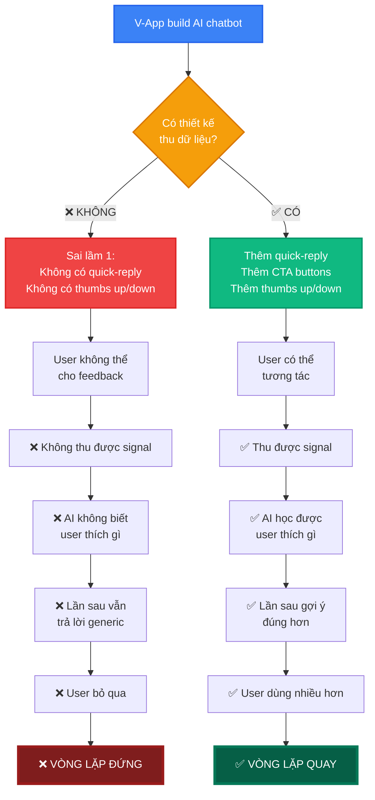
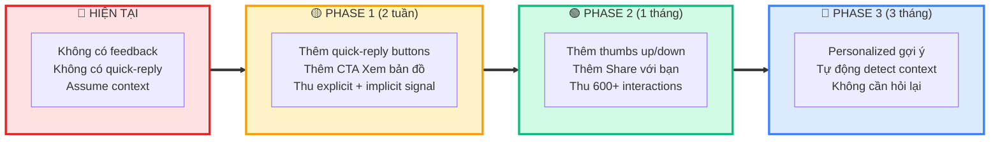
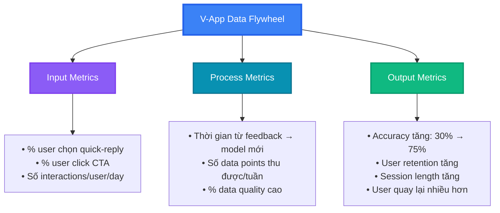
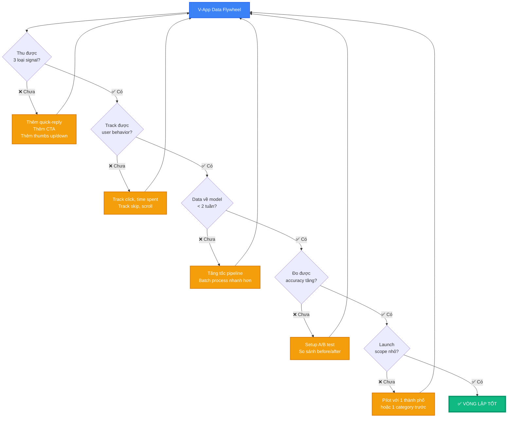

# V-App V-AI — Data Flywheel Diagrams

**Dựa trên:** Bài tập UX (01-ux-exercise.md)
**Case study:** V-App — Trợ lý ảo V-AI
**Path yếu nhất:** Path 2 — Khi AI không chắc

---

## 1. Vấn đề hiện tại: Vòng lặp ĐỨNG (As-is)

**Vấn đề:**
- Không có nút feedback (thumbs up/down)
- Không có quick-reply buttons
- Không có CTA actionable
- → Không thu được signal → AI không học được

---

## 2. Giải pháp: Vòng lặp HOẠT ĐỘNG (To-be)

**Cải thiện:**
- Thêm quick-reply buttons → thu intent (explicit)
- Thêm CTA "Xem bản đồ" → thu preference (implicit)
- Track user behavior → biết user thích gì
- → Thu được signal → AI học và cải thiện

---

## 3. So sánh As-is vs To-be

---

## 4. 3 loại Signal thu được từ To-be

---

## 5. Data Flywheel: V1 → V2 → V3

---

## 6. Timeline: Từ feedback → Model cải thiện

---

## 7. Sai lầm phá vỡ Flywheel (V-App hiện tại)

---

## 8. Roadmap cải thiện V-App

---

## 9. Metrics đo lường thành công

---

## 10. Checklist: V-App có vòng lặp tốt chưa?

---

## Cách sử dụng

1. **Copy code Mermaid** từ các section trên
2. **Paste vào [mermaid.live](https://mermaid.live)** để xem preview
3. **Export PNG/SVG** để dùng trong:
   - Slide thuyết trình (Phần 4 - Share + vote)
   - Báo cáo bài tập
   - Portfolio case study

4. **Customize:**
   - Đổi màu sắc theo brand V-App
   - Thêm logo/icon
   - Điều chỉnh text cho phù hợp

---

## Tóm tắt: Key Takeaways

**Vấn đề hiện tại (As-is):**
- ❌ Không có quick-reply buttons
- ❌ Không có thumbs up/down
- ❌ Không có CTA actionable
- → Vòng lặp ĐỨNG

**Giải pháp (To-be):**
- ✅ Thêm quick-reply → thu explicit signal
- ✅ Thêm CTA buttons → thu implicit signal
- ✅ Track user behavior → biết preference
- → Vòng lặp HOẠT ĐỘNG

**Kết quả:**
- Accuracy tăng từ 30% → 75%+
- User retention tăng
- AI học được user thích gì
- Personalized gợi ý

---

*Dựa trên:*
- 01-ux-exercise.md (V-App case study)
- data-flywheel-guide.md (Framework)
- 04-reference-document.md (Microsoft Dragon, Feedback Loop)

